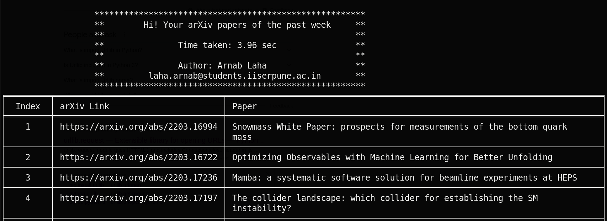

# CodesForFun
### arXivToday.py
This piece of python code should dump all the hep-ex (or of your field) papers appeared last week on your terminal like the following,

```Index```, ```arXiv Link```, ```Paper Title``` 

Command: ```python3 arXivToday.py``` 

**NB:** This code should install the required packages if not present. You don't need to install it. Python package is mandatory. Install it before proceeding further. Python -v 3.6 or later is preferred. 
- **Packages needed**
   + urllib to open url
   + bs4: Beautiful Soup module to parse the html content
   + tabulate: Presenting the arXiv Link and paper name in a pretty table  
- **What this code expect from you?**
   + The only user input is the *url*
   + default is https://arxiv.org/list/hep-ex/pastweek?show=500: for recent submission- last one week from the current date 

As an example,

