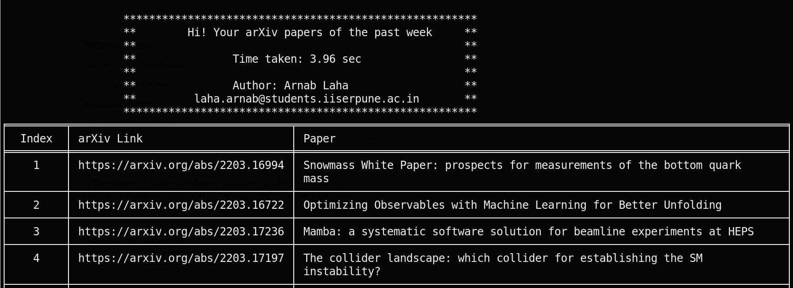
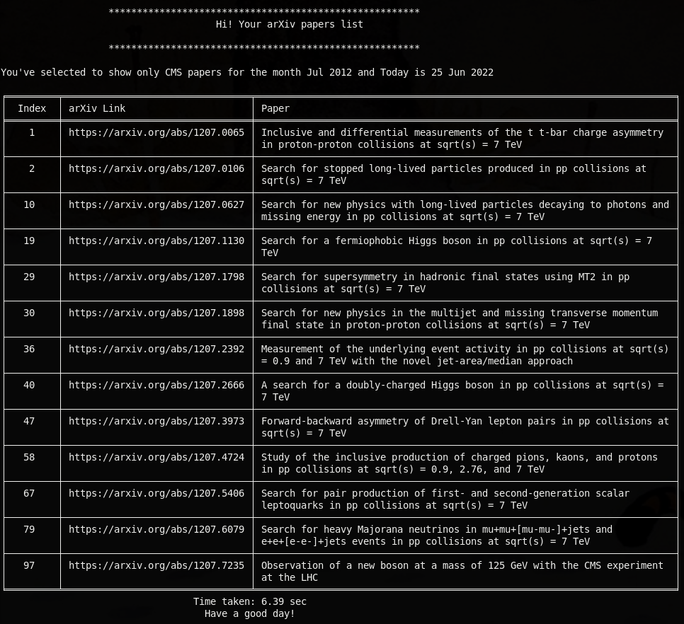
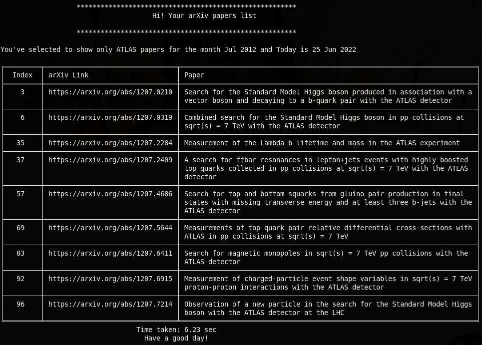

# CodesForFun
### arXivToday.py
This piece of python code should show all the hep-ex (or of your field) papers appeared last week on your terminal like the following,

```Index```, ```arXiv Link```, ```Paper Title``` 

Command: ```python3 arXivToday.py``` 

**NB:** This code should install the required packages if not present. You don't need to install it. Python package is mandatory. Install it before proceeding further. Python -v 3.6 or later is preferred. 
- **Packages needed**
   + urllib to open url
   + bs4: Beautiful Soup module to parse the html content
   + tabulate: Presenting the arXiv Link and paper name in a pretty table  
- **What this code expect from you?**
   + The only user input is the *url*
   + default is https://arxiv.org/list/hep-ex/pastweek?show=500: for recent submission- last one week from the current date 

As an example,


<hr>

## Advanced Search for arXiv Papers  
### arXivAdvanced.py
This advance script helps to do a customized search in arXiv and show them on your terminal. The customized options are the following,
+ ```--collab```: CMS or ATLAS or Belle etc 
   + Select only CMS/ATLAS/BELLE/OTHER Collaboration papers (e.g. ```--collab CMS```)
+ ```--time   ```: weekly or monthly or First Three letters of month
   + Select papers of your choice of any 12 months or pastweek or current month(e.g. ```--time Dec```, ```--time weekly``` or ```---time monthly```)
+ ```--year   ```: Any year wise search
   + Select papers of any year (e.g. ```--year 2022``` or ```--year 2010```)
+ Arguments are optional. If you don't use any arguments **arXivToday.py** and **arXivAdvanced.py** show same result which is current or past week, current month and current year, ALL PAPERS    
   
** Example Commands**

- Current week,  Current year, ALL papers => ```python3 arXivAdvanced.py```
- Current week,  Current year, CMS papers => ```python3 arXivAdvanced.py --collab CMS```
- Current month, Current year, CMS papers => ```python3 arXivAdvanced.py --collab CMS --time monthly```
- Custom  month, Custom  year, CMS papers => ```python3 arXivAdvanced.py --collab CMS --time May --year 2019```
   + Shows all CMS papers for the month MAY in year 2019

**More Examples**

 ```python3 arXivAdvanced.py --collab CMS --time Jul --year 2012```
 
 ```python3 arXivAdvanced.py --collab ATLAS --time Jul --year 2012```
  
 
 **July 2012 ALL CMS Papers** (Look for the famous 125 GeV Higgs Boson Paper)
 
 
 
 
 **July 2012 ALL ATLAS Papers** (Look for the famous 125 GeV Higgs Boson Paper)
 
 

